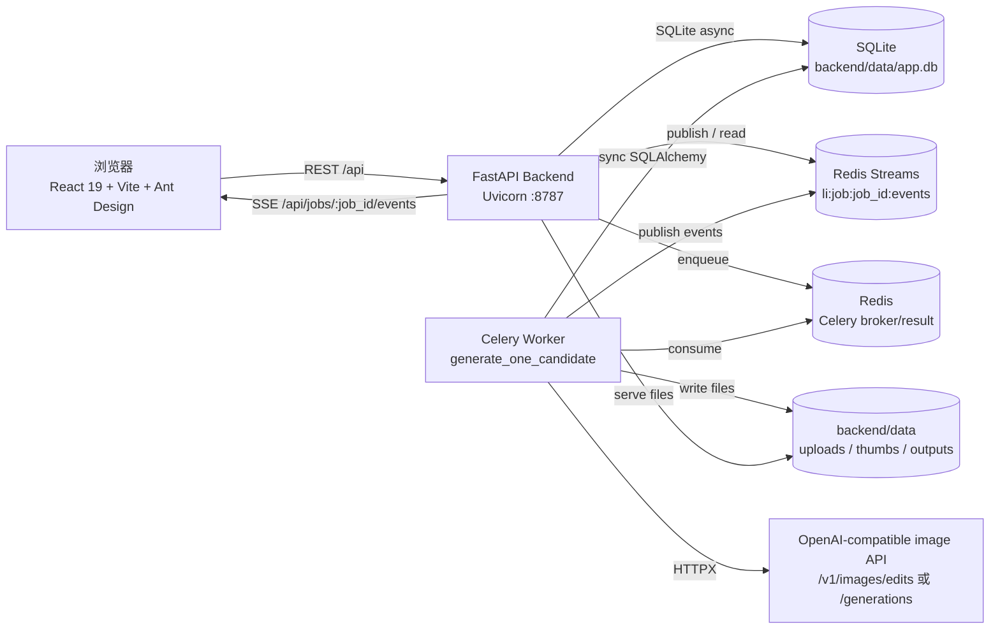
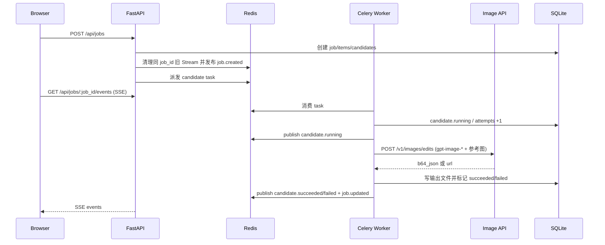

# 本地批量图片生成工作台

本地化、单用户的批量图片生成工作台。支持上传/扫描本地图片，按模板批量调用 OpenAI 兼容图像接口生成候选图，并通过 SSE 实时展示进度、日志和结果。

> 当前实现重点面向“参考图改图 / 图片编辑”链路：`gpt-image-*` + 参考图会调用 `/v1/images/edits`；其它兼容模型默认走 `/v1/images/generations`。

## 功能概览

- API 配置：保存多套 OpenAI 兼容接口地址、API Key、默认模型；支持 `/v1/models` 拉取模型列表。
- 图片来源：本地目录扫描或浏览器上传，自动生成缩略图。
- 模板与提示词：内置流程模板 + 自定义模板，支持 `{prompt}` 占位。
- 批量生成：每张源图可生成多个候选，Celery 并发执行。
- 实时反馈：Redis Streams + SSE 推送 candidate/job 状态。
- 失败处理：可配置自动重试；鉴权/模型配置类错误不重试；历史任务可手动“重试失败候选”。
- 结果管理：候选预览、设为选中、下载全部/选中、历史记录和删除。

## 架构图



## 生成链路



## 技术栈

- 后端：FastAPI 0.115 + Python 3.13 + SQLAlchemy 2 async + Alembic + Pydantic v2
- 任务：Celery 5 + Redis broker/result
- 事件：Redis Streams + Server-Sent Events
- 存储：SQLite + `backend/data` 本地文件
- 前端：React 19 + TypeScript + Vite 6 + Ant Design 5 + Zustand + TanStack Query

## 快速启动：Docker Compose

需要 Docker 与 Docker Compose v2。

```bash
cp .env.example .env
docker compose up --build
```

访问：

- 前端：http://localhost:5178
- 后端：http://localhost:8787
- 健康检查：http://localhost:8787/api/health
- 就绪检查：http://localhost:8787/api/ready
- OpenAPI：http://localhost:8787/api/docs

常用命令：

```bash
# 后台启动
docker compose up -d --build

# 查看日志
docker compose logs -f backend worker frontend

# 仅重启 worker（改了任务代码时常用）
docker compose restart worker

# 停止
docker compose down
```

## Windows 宿主机本地开发启动

适合你已经在本机安装 Redis、Node、pnpm、uv 的场景。请开 3 个 PowerShell 窗口。

### 1. Redis

```powershell
redis-cli ping
```

返回 `PONG` 即可。

### 2. 后端 API

```powershell
cd D:\py_project\local_image\backend

$env:APP_DATA_DIR = "D:\py_project\local_image\backend\data"
$env:TASK_BACKEND = "celery"
$env:REDIS_URL = "redis://127.0.0.1:6379/0"
$env:CELERY_BROKER_URL = "redis://127.0.0.1:6379/1"
$env:CELERY_RESULT_BACKEND = "redis://127.0.0.1:6379/2"
$env:CORS_ORIGINS = "http://localhost:5173"

uv sync
uv run uvicorn app.main:app --reload --host 127.0.0.1 --port 8787
```

### 3. Celery Worker

Windows 本地建议使用 `-P solo`：

```powershell
cd D:\py_project\local_image\backend

$env:APP_DATA_DIR = "D:\py_project\local_image\backend\data"
$env:TASK_BACKEND = "celery"
$env:REDIS_URL = "redis://127.0.0.1:6379/0"
$env:CELERY_BROKER_URL = "redis://127.0.0.1:6379/1"
$env:CELERY_RESULT_BACKEND = "redis://127.0.0.1:6379/2"

uv run celery -A app.core.celery_app.celery_app worker -l INFO -P solo
```

### 4. 前端

```powershell
cd D:\py_project\local_image\frontend

$env:VITE_API_BASE = "/api"
$env:VITE_BACKEND_TARGET = "http://127.0.0.1:8787"

pnpm install
pnpm dev
```

本地开发前端访问：http://localhost:5173

## OpenAI 兼容接口约定

保存 API 配置时填写 base URL，例如：

```text
https://api.example.com
```

后端会自动拼接：

- 获取模型：`GET {base_url}/v1/models`
- `gpt-image-*` 且有参考图：`POST {base_url}/v1/images/edits`
- 其它模型：`POST {base_url}/v1/images/generations`

请求使用 multipart：

- `image`: 源图文件
- `model`: 前端选择的模型
- `prompt`: 渲染后的模板提示词
- `size`: 图片尺寸
- `n`: `1`
- `response_format`: `b64_json`

响应支持两种格式：

```json
{"data":[{"b64_json":"..."}]}
```

或：

```json
{"data":[{"url":"https://..."}]}
```

## 重试与错误分类

- `429`、网络错误、普通 `5xx`：按任务配置自动重试。
- `401/403`：鉴权失败，不重试。
- `4xx`：请求/模型参数错误，不重试。
- 上游把 `model_not_found`、`No available channel for model` 包成 `503` 时：按配置/模型错误处理，不重试。
- 手动重试：历史记录里“重试整批”只会重置并重新派发 failed 候选，保留 succeeded 候选。

## SSE 与 Redis Stream 注意事项

每个 job 使用一个 Redis Stream：

```text
li:job:{job_id}:events
```

新 job 创建时会清理同 id 的旧 Stream，避免开发环境重建 SQLite 后 job id 复用，导致前端回放到旧 `job.terminated` 后反复重连。

如本地调试中需要手工清理：

```powershell
redis-cli DEL li:job:18:events li:job:19:events
```

## 目录结构

```text
local_image/
├── docs/方案设计.md
├── docker-compose.yml
├── .env.example
├── backend/
│   ├── app/
│   │   ├── api/          # REST + SSE routers
│   │   ├── core/         # settings/db/celery/logging/crypto
│   │   ├── models/       # SQLAlchemy models
│   │   ├── schemas/      # Pydantic schemas
│   │   ├── services/     # event_bus/storage/openai_image/job_runner
│   │   └── tasks/        # Celery tasks
│   ├── alembic/
│   ├── data/             # app.db / uploads / thumbs / outputs / .fernet_key
│   └── tests/
└── frontend/
    ├── src/
    │   ├── api/
    │   ├── components/
    │   ├── pages/
    │   └── store/
    └── package.json
```

## 测试

```powershell
# 后端
cd backend
uv run pytest

# 前端
cd frontend
pnpm typecheck
pnpm test
```

当前覆盖重点：API 配置、图片上传/扫描、模板校验、任务创建/取消/重试、并发聚合、SSE 终态关闭、文件下载、存储统计、OpenAI 兼容响应解析。

## 数据与安全

- API Key 使用 Fernet 加密，密钥位于 `backend/data/.fernet_key`；请备份该文件，否则已保存的 API Key 可能无法解密。
- `backend/data/app.db`、`uploads/`、`thumbs/`、`outputs/` 默认不提交。
- 文件访问接口会校验路径在允许范围内，并记录审计日志。
