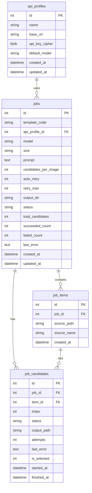
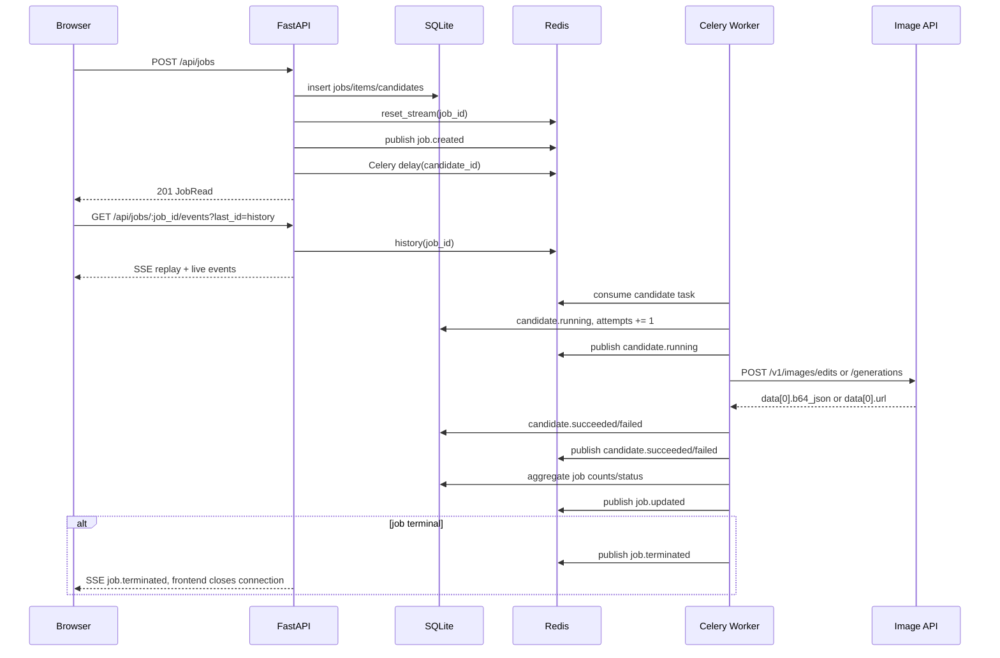

# 本地批量图片生成工作台 · 架构设计

> 当前文档描述仓库当前实现，而不是早期草案。  
> 更新时间：2026-05-08

## 1. 产品定位

本项目是一个本地化批量图片生成工作台：用户上传或扫描本地图片，选择流程模板、模型、尺寸和输出目录后，后端把每张图片拆成多个候选生成任务，由 Celery worker 并发调用 OpenAI 兼容图像接口，前端通过 SSE 实时展示状态、日志和结果。

核心能力：

- 本地图片扫描 / 上传 / 缩略图预览
- API Profile 管理：base URL、API Key、默认模型、拉取 `/v1/models`
- 模板 + 用户提示词组合，支持 `{prompt}` 占位
- Celery 并发生成候选图
- Redis Streams + SSE 实时推送
- 历史记录、失败候选手动重试、取消、删除
- 候选图设为选中、批量下载全部或选中结果

## 2. 当前架构

```mermaid
flowchart TB
  subgraph Client[浏览器]
    UI["React 19 + Vite 6<br/>Ant Design + Zustand + TanStack Query"]
  end

  subgraph Backend[FastAPI 后端 :8787]
    API["REST Routers<br/>/api/jobs / images / templates / api-profiles"]
    SSE["SSE Router<br/>/api/jobs/:job_id/events"]
    Runner["Job Runner<br/>创建 DB 记录并派发候选"]
    FileAPI["Files API<br/>/api/files"]
  end

  subgraph State[本地状态]
    DB[("SQLite<br/>backend/data/app.db")]
    FS[("backend/data<br/>uploads / thumbs / outputs")]
    Stream[("Redis Streams<br/>li:job:job_id:events")]
    Broker[("Redis<br/>Celery broker/result")]
  end

  subgraph Worker[任务执行]
    Celery["Celery Worker<br/>generate_one_candidate"]
    Gen["OpenAI Image Client<br/>httpx"]
  end

  Provider["OpenAI-compatible API<br/>/v1/models<br/>/v1/images/edits<br/>/v1/images/generations"]

  UI -->|REST| API
  UI -->|EventSource| SSE
  API --> Runner
  API --> DB
  API --> FileAPI
  FileAPI --> FS
  Runner --> DB
  Runner -->|reset + publish job.created| Stream
  Runner -->|delay(candidate_id)| Broker
  SSE -->|history/read_stream| Stream
  Celery -->|consume| Broker
  Celery --> DB
  Celery --> FS
  Celery -->|publish candidate/job events| Stream
  Celery --> Gen
  Gen --> Provider
```

### 2.1 端口

| 服务 | Docker Compose | 本地开发 |
|---|---:|---:|
| Frontend | `localhost:5178` → 容器内 `5173` | `localhost:5173` |
| Backend | `localhost:8787` | `localhost:8787` |
| Redis | compose 内网服务名 `redis` | `127.0.0.1:6379` |

### 2.2 关键组件

| 组件 | 路径 | 说明 |
|---|---|---|
| FastAPI app | `backend/app/main.py` | 注册中间件、路由、lifespan 初始化 DB/模板 |
| 配置 | `backend/app/core/settings.py` | `.env` / 环境变量读取 |
| DB | `backend/app/core/db.py` | SQLite async engine + Alembic upgrade |
| Celery app | `backend/app/core/celery_app.py` | broker/result 配置、worker 日志初始化 |
| Job API | `backend/app/api/jobs.py` | 创建、详情、列表、取消、选择、下载、重试、删除 |
| Job Runner | `backend/app/services/job_runner.py` | 创建 job/items/candidates，清理旧 Stream，派发 task |
| Worker Task | `backend/app/tasks/generate.py` | 生成单个 candidate、重试、聚合 job 状态、发布事件 |
| 事件总线 | `backend/app/services/event_bus.py` | Redis Stream publish/history/read/reset |
| 图像客户端 | `backend/app/services/openai_image.py` | 选择 `/edits` 或 `/generations`，解析 b64/url 响应 |
| SSE 客户端 | `frontend/src/api/sse.ts` | EventSource + last_id 重连 |
| Job Store | `frontend/src/store/jobStore.ts` | 当前 job/detail/events，过滤非当前 job 事件 |

## 3. 数据模型

当前实现使用 `jobs / job_items / job_candidates`。



状态枚举：

- Job：`queued | running | succeeded | failed | cancelled`
- Candidate：`queued | running | succeeded | failed | cancelled`

聚合规则在 `backend/app/tasks/generate.py::_aggregate_job_status` 中以单条 SQL 更新完成，避免多 worker 并发完成时计数被旧 session 覆盖。

## 4. 生成任务时序



## 5. 外部图像 API 约定

API Profile 只保存服务前缀，例如：

```text
https://api.example.com
```

后端自动拼接：

| 场景 | 方法 |
|---|---|
| 拉模型 | `GET {base_url}/v1/models` |
| `gpt-image-*` + 参考图 | `POST {base_url}/v1/images/edits` |
| 其它兼容模型 | `POST {base_url}/v1/images/generations` |

图像请求为 multipart：

| 字段 | 说明 |
|---|---|
| `image` | 源图文件 |
| `model` | job 中保存的模型，如 `gpt-image-2` |
| `prompt` | 模板渲染后的提示词 |
| `size` | 例如 `1024x1024` |
| `n` | 固定为 `1`，多候选由 task 层并发 |
| `response_format` | `b64_json` |

响应兼容：

```json
{"data":[{"b64_json":"..."}]}
```

或：

```json
{"data":[{"url":"https://..."}]}
```

## 6. 错误与重试策略

自动重试条件由 worker 内部判断：

| 错误 | 自动重试 |
|---|---|
| 网络连接错误 / 超时 | 是 |
| `429` | 是 |
| 普通 `5xx` | 是 |
| `401/403` | 否 |
| `4xx` | 否 |
| 上游 `503` 但 body 中包含 `model_not_found`、`No available channel for model` 等配置错误 | 否 |
| 响应不含 `data[0].b64_json/url` | 否 |

`retry_max` 表示失败后的额外重试次数；例如 `retry_max=1` 时最多尝试 2 次。

手动重试接口：

```text
POST /api/jobs/{job_id}/retry-failed
```

只会重置并重新派发 `status='failed'` 的 candidates，保留成功结果。

## 7. SSE 与 Redis Streams

每个 job 对应一个 Stream：

```text
li:job:{job_id}:events
```

事件类型：

- `job.created`
- `job.updated`
- `job.terminated`
- `candidate.running`
- `candidate.retry`
- `candidate.succeeded`
- `candidate.failed`
- `candidate.selected`
- `ping`
- `error`

关键防护：

1. 新 job 创建时执行 `reset_stream(job_id)`，避免开发环境 SQLite id 复用但 Redis 旧 Stream 还在。
2. 前端只给非终态 job 订阅 SSE。
3. 前端 store 丢弃非当前 `job_id` 的事件。
4. 收到 `job.terminated` 后客户端关闭 EventSource。

## 8. REST API

| Method | Path | 说明 |
|---|---|---|
| GET | `/api/health` | 简单健康检查 |
| GET | `/api/ready` | DB / Redis / Fernet 就绪检查 |
| POST | `/api/images/upload` | 多文件上传 |
| POST | `/api/images/scan` | 扫描本地目录 |
| GET | `/api/files?path=...` | 受控文件读取 |
| GET | `/api/templates` | 模板列表 |
| POST | `/api/templates` | 新建模板 |
| GET | `/api/api-profiles` | API 配置列表 |
| POST | `/api/api-profiles` | 新建 API 配置 |
| PATCH | `/api/api-profiles/{id}` | 更新配置 |
| DELETE | `/api/api-profiles/{id}` | 删除配置 |
| POST | `/api/api-profiles/{id}/models` | 拉取外部模型 |
| POST | `/api/jobs` | 创建任务 |
| GET | `/api/jobs` | 历史任务列表 |
| GET | `/api/jobs/{id}` | 任务详情 |
| GET | `/api/jobs/{id}/events` | SSE 事件流 |
| POST | `/api/jobs/{id}/cancel` | 取消任务 |
| POST | `/api/jobs/{id}/retry-failed` | 重试失败候选 |
| PATCH | `/api/jobs/{id}/candidates/{candidate_id}/select` | 设置候选选中 |
| GET | `/api/jobs/{id}/download?scope=all|selected` | 下载 zip |
| DELETE | `/api/jobs/{id}` | 删除终态任务及输出目录 |
| GET | `/api/storage/usage` | 存储用量 |

`POST /api/jobs` 示例：

```json
{
  "template_code": "ref_batch",
  "api_profile_id": 1,
  "model": "gpt-image-2",
  "size": "1024x1024",
  "prompt": "体现科技感",
  "candidates_per_image": 3,
  "auto_retry": true,
  "retry_max": 1,
  "output_dir": "outputs",
  "source_paths": ["D:/py_project/local_image/backend/data/uploads/xxx/chart.png"]
}
```

## 9. 文件与目录

`APP_DATA_DIR` 默认为容器内 `/app/data`；本地开发建议设为：

```powershell
D:\py_project\local_image\backend\data
```

主要目录：

```text
backend/data/
├── app.db
├── .fernet_key
├── uploads/
├── thumbs/
└── outputs/
```

`output_dir` 推荐使用相对路径 `outputs`。后端会解析到：

```text
{APP_DATA_DIR}/outputs/{job_id}/{item_id}/cand_{index}.png
```

## 10. 启动方式

### Docker Compose

```bash
cp .env.example .env
docker compose up --build
```

访问：

- 前端：http://localhost:5178
- 后端：http://localhost:8787

### Windows 本地开发

后端：

```powershell
cd D:\py_project\local_image\backend
$env:APP_DATA_DIR = "D:\py_project\local_image\backend\data"
$env:REDIS_URL = "redis://127.0.0.1:6379/0"
$env:CELERY_BROKER_URL = "redis://127.0.0.1:6379/1"
$env:CELERY_RESULT_BACKEND = "redis://127.0.0.1:6379/2"
$env:CORS_ORIGINS = "http://localhost:5173"
uv run uvicorn app.main:app --reload --host 127.0.0.1 --port 8787
```

Worker：

```powershell
cd D:\py_project\local_image\backend
$env:APP_DATA_DIR = "D:\py_project\local_image\backend\data"
$env:REDIS_URL = "redis://127.0.0.1:6379/0"
$env:CELERY_BROKER_URL = "redis://127.0.0.1:6379/1"
$env:CELERY_RESULT_BACKEND = "redis://127.0.0.1:6379/2"
uv run celery -A app.core.celery_app.celery_app worker -l INFO -P solo
```

前端：

```powershell
cd D:\py_project\local_image\frontend
$env:VITE_API_BASE = "/api"
$env:VITE_BACKEND_TARGET = "http://127.0.0.1:8787"
pnpm dev
```

## 11. 测试

```powershell
cd backend
uv run pytest

cd ../frontend
pnpm typecheck
pnpm test
```

当前测试重点：

- OpenAI 响应解析与错误分类
- API Profile CRUD 与拉模型
- 图片上传/扫描与路径安全
- 任务创建、取消、重试失败候选、删除
- 多 worker 并发聚合计数
- SSE 终态关闭与旧 Stream 清理
- 文件下载、存储统计

## 12. 运行注意事项

- Worker 代码变更后必须重启 worker。
- 修改 `openai_image.py` 后，已在队列中的旧 task 不会自动变更行为，建议清空/重启 worker 后重新提交任务。
- 如果开发中重建 SQLite 或切换数据目录，可手工清 Redis：

```powershell
redis-cli FLUSHDB
```

或删除单个 job Stream：

```powershell
redis-cli DEL li:job:18:events
```

- `backend/data/.fernet_key` 需要备份；丢失后已保存 API Key 可能无法解密。
